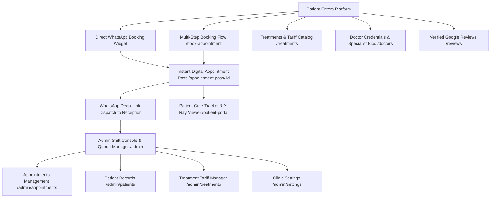

# 🦷 Tooth Story Dental Clinic — Web Platform & Front-Desk Dispatch System

> **A high-precision, production-grade web application, automated WhatsApp reservation engine, digital patient care tracker, and staff reception console for Tooth Story Dental Clinic, Electronic City, Bengaluru.**

---

## 🌟 Verified Clinic Identity & Ground Truth

| Attribute | Details |
| :--- | :--- |
| **Clinic Name** | **Tooth Story Dental Clinic** |
| **Chief Dental Surgeons** | **Dr. Dhanashree** (BDS, MDS - Endodontist & Smile Specialist)<br>**Dr. Anand** (BDS, MDS - Orthodontist & Dentofacial Orthopedics) |
| **Clinic Address** | Malligue Residency, 16th Cross Road, Neeladri Nagar, Electronic City Phase I, Doddathoguru, Karnataka 560100 |
| **Location Plus Code** | `RJRW+C3 Doddathoguru` |
| **Direct Helpline** | `090369 40356` |
| **WhatsApp Booking Desk** | `+91 9036940356` (`90369 40356`) |
| **Google Review Score** | **4.9 ★★★★★** *(480+ Verified Google Reviews)* |
| **Operating Hours** | **9:00 AM – 10:00 PM** (Open all 7 days a week) |
| **Google Maps** | [Open in Google Maps](https://maps.google.com/?q=Tooth+Story+Dental+Clinic+Neeladri+Nagar+Electronic+City) |

---

## 🚀 Key Modules & Architecture



---

## ✨ Features Overview

### 1. Public Patient Experience
- **Clinical Luxury Aesthetic:** Modern Sage/Teal (`#0E7490` / `#0D9488`), crisp porcelain surfaces (`#FFFFFF` / `#F8FAFC`), deep marine slate contrast, and refined micro-interactions.
- **2-Step WhatsApp Reservation Desk:** Interactive slot preference builder that constructs structured WhatsApp messages with instant clinic database persistence.
- **Interactive Multi-Step Booking (`/book-appointment`):** Procedure selection, date picker, time slot blocks (Morning, Afternoon, Evening), patient information, and instant pass generation.
- **Transparent Treatments & Tariff (`/treatments` & `/treatments/[slug]`):** Full treatment index with upfront pricing, step-by-step procedure guides, German biomaterial certifications, and treatment-specific WhatsApp booking triggers.
- **Specialist Profiles (`/doctors`):** Dr. Dhanashree (Rotary RCT & Cosmetic Restorations) and Dr. Anand (Invisible Clear Aligners & Braces).
- **Verified Google Reviews Showcase (`/reviews`):** 4.9★ rating breakdown, verified patient testimonials, and direct feedback submission.
- **Ambience & Sterilization Gallery (`/gallery`):** High-resolution operatory suites, RVG digital sensor imaging, and sterile lounge photography.
- **Contact & Directions Hub (`/contact`):** Integrated Google Maps directions, Plus Code navigation, dedicated parking indicators, and quick reception dialer.

### 2. Patient Post-Care & Boarding Pass Experience
- **Digital Boarding Pass (`/appointment-pass/[id]`):**
  - QR Code for 1-tap reception check-in.
  - Assigned clinician, procedure focus, and time slot.
  - Add to Google Calendar & Apple Calendar (.ics).
  - Anxiety-Free Preparation Checklist (brushing, meal advice, medical history prep).
  - Live WhatsApp quick-actions for directions and traffic delays.
- **Patient Portal Care Tracker (`/patient-portal`):**
  - Live recovery progress timeline (Day 1 to Full Healing).
  - Interactive Post-Op Gargle Tracker with daily compliance logs.
  - High-Resolution Digital RVG X-Ray Viewer with clinical findings.
  - Treatment History & Invoicing Ledger.

### 3. Clinic Front-Desk Admin System (`/admin`)
- **Shift Console Dashboard:** 4 Real-time KPI summary cards (Appointments Scheduled, WhatsApp Leads with response speed, Daily Collections, Active Clinicians).
- **WhatsApp Triage & Lead Pipeline:** Real-time search, instant *"Approve & Send WA Confirmation"*, *"Send WA Reminder"*, and direct call trigger.
- **Quick Broadcast Templates:** 1-Day Prior Reminder batch trigger, Post-Extraction Protocol PDF & audio care guidelines, Google 5★ Feedback Link trigger.
- **Chairs Live Occupancy (3 Operatory Bays):**
  - Chair 1: Dr. Dhanashree (Endodontics)
  - Chair 2: Pediatric & Hygiene Bay
  - Chair 3: Dr. Anand (Orthodontics)
- **Appointments Management (`/admin/appointments`):** Full status filters (`pending`, `confirmed`, `completed`, `rescheduled`, `cancelled`, `no_show`), status dropdown, edit notes modal, and walk-in creator.
- **Patient Records Archive (`/admin/patients`):** Complete patient directory with treatment history, visit counts, and instant communication links.
- **Treatments Tariff Manager (`/admin/treatments`):** Manage pricing, edit procedures, and toggle active listings.
- **Clinic Settings (`/admin/settings`):** Manage live contact numbers, shift timings, address, and Google Maps coordinates.

---

## 🛠️ Technology Stack

| Layer | Technology |
| :--- | :--- |
| **Framework** | [Next.js 14](https://nextjs.org/) (App Router, Server Components & Client Hooks) |
| **Language** | [TypeScript](https://www.typescriptlang.org/) (Strict Mode) |
| **Styling** | [Tailwind CSS](https://tailwindcss.com/) + Custom Design Tokens |
| **Icons** | [Lucide React](https://lucide.dev/) |
| **Typography** | [Plus Jakarta Sans](https://fonts.google.com/specimen/Plus+Jakarta+Sans) |
| **Database & Auth** | [Firebase](https://firebase.google.com/) (Cloud Firestore & Authentication) + Mock Fallback Storage |
| **Validation** | [Zod](https://zod.dev/) |

---

## 📂 Project Directory Structure

```text
Dental-website/
├── .env.example                     # Environment variables template
├── .gitignore                       # Production gitignore (excludes caches, secrets, logs)
├── firestore.rules                  # Production Firestore security rules
├── next.config.mjs                  # Next.js configuration & image domains
├── package.json                     # Dependencies & scripts
├── tailwind.config.js               # Clinical luxury color tokens & spacing
├── tsconfig.json                    # TypeScript compiler configuration
├── src/
│   ├── app/                         # Next.js 14 App Router Pages
│   │   ├── layout.tsx               # Root layout, metadata & global fonts
│   │   ├── page.tsx                 # High-conversion Homepage
│   │   ├── treatments/              # Treatments index & dynamic [slug] pages
│   │   ├── doctors/                 # Doctor credentials & bios
│   │   ├── reviews/                 # Google reviews & ratings
│   │   ├── gallery/                 # Ambience & operatory gallery
│   │   ├── about/                   # Clinic philosophy & technology
│   │   ├── contact/                 # Clinic address, phone & map
│   │   ├── book-appointment/        # Dedicated multi-step booking flow
│   │   ├── appointment-pass/[id]/   # Digital appointment pass & QR ticket
│   │   ├── patient-portal/          # Post-op recovery & X-ray care tracker
│   │   └── admin/                   # Staff Reception Portal
│   │       ├── page.tsx             # Dispatch dashboard & shift console
│   │       ├── login/               # Staff authentication & 1-click demo
│   │       ├── appointments/        # Full appointments manager
│   │       ├── patients/            # Patient directory
│   │       ├── treatments/          # Pricing & tariff manager
│   │       ├── doctors/             # Doctor schedules
│   │       ├── reviews/             # Patient testimonials manager
│   │       ├── gallery/             # Photo gallery manager
│   │       └── settings/            # Clinic contact & hours configuration
│   ├── components/
│   │   ├── layout/                  # Header, Footer, MobileStickyBar
│   │   ├── ui/                      # Logo (isolated SVG with useId), Cards, Modals
│   │   ├── booking/                 # WhatsAppBookingWidget
│   │   ├── treatments/              # TreatmentCard
│   │   ├── doctors/                 # DoctorCard
│   │   ├── reviews/                 # ReviewCard
│   │   └── admin/                   # AdminSidebar, AdminHeader, KPI Cards
│   ├── lib/
│   │   ├── firebase.ts              # Firebase client initialization
│   │   ├── whatsapp.ts              # WhatsApp URL builder & sanitizers
│   │   └── utils.ts                 # Formatting & class utilities
│   ├── services/                    # Data access layer (Firestore + Local fallback)
│   │   ├── appointments.ts          # Appointment CRUD & queries
│   │   ├── treatments.ts            # Treatment list & details
│   │   ├── doctors.ts               # Doctor rosters
│   │   └── reviews.ts               # Review data
│   └── types/                       # TypeScript interfaces & models
```

---

## 🔒 Security & Firestore Rules

Production security rules are located in [`firestore.rules`](./firestore.rules):
- **Public Visitors:** Can only submit new pending appointment booking requests (`create`). Public reading, updating, or deleting of patient records and appointment tables is strictly disallowed.
- **Clinic Staff:** Authenticated receptionists and doctors have full read/write access to triage leads, update statuses, and maintain clinic content.

---

## 💻 Local Development Setup

### 1. Clone & Install Dependencies
```bash
git clone <your-repository-url>
cd Dental-website
npm install
```

### 2. Configure Environment Variables (Optional for Firebase)
Copy `.env.example` to `.env.local`:
```bash
cp .env.example .env.local
```
*(If Firebase keys are omitted, the application automatically operates with resilient local mock data).*

### 3. Run the Development Server
```bash
npm run dev
```
Open [http://localhost:3000](http://localhost:3000) in your browser.

---

## 🔐 Staff Reception Portal Access

To access the front-desk console:
1. Navigate to: [http://localhost:3000/admin/login](http://localhost:3000/admin/login)
2. Click **"1-Click Receptionist Demo Login"** or use:
   - **Email:** `admin@toothstory.com`
   - **Password:** `password123`

---

## 📦 Production Build & Validation

```bash
# Type-check TypeScript
npx tsc --noEmit

# Create optimized production build
npm run build

# Start production server
npm run start
```

---

## 📄 License
Designed and developed for **Tooth Story Dental Clinic, Electronic City, Bengaluru**. All rights reserved.
